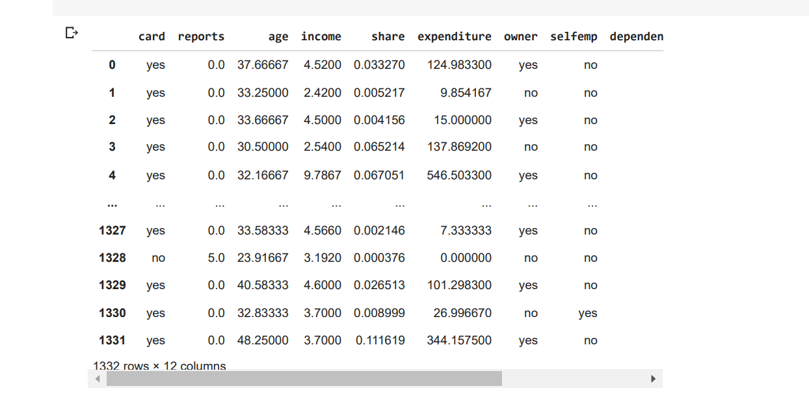
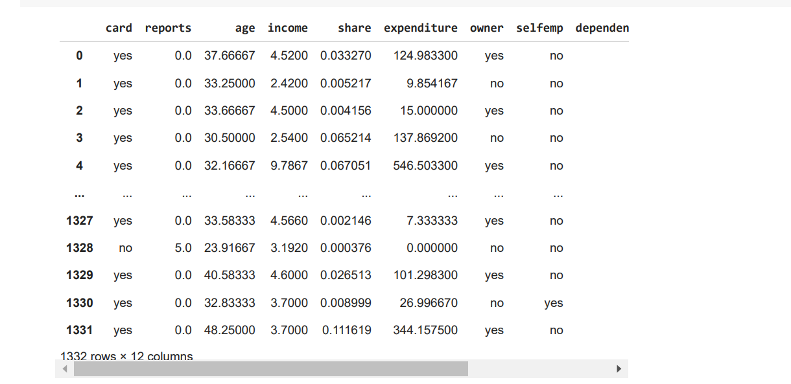
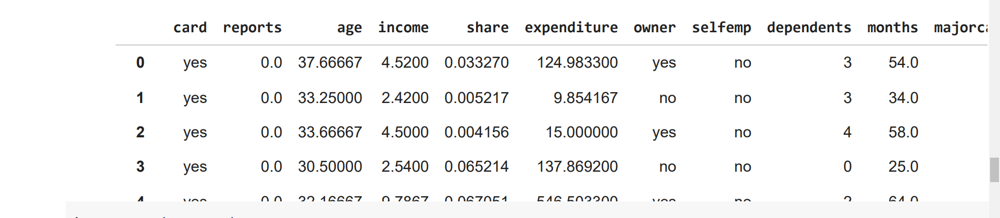
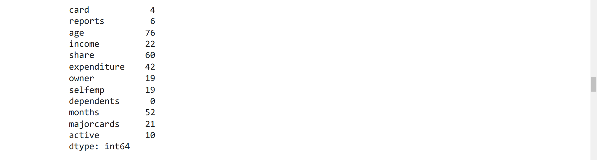
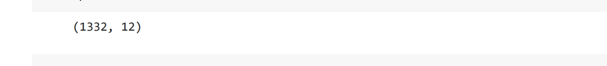
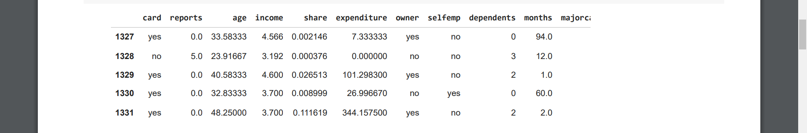
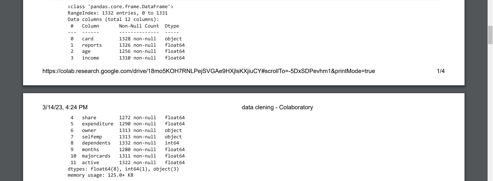
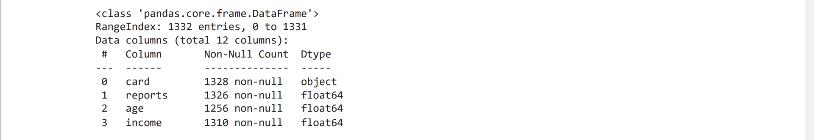
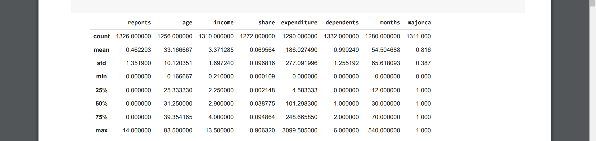

# Ex-01_DS_Data_Cleansing
# AIM
To read the given data and perform data cleaning and save the cleaned data to a file.

# Explanation
Data cleaning is the process of preparing data for analysis by removing or modifying data that is incorrect ,incompleted , irrelevant , duplicated or improperly formatted. Data cleaning is not simply about erasing data ,but rather finding a way to maximize datasets accuracy without necessarily deleting the information.

# ALGORITHM
## STEP 1
Read the given Data

## STEP 2
Get the information about the data

## STEP 3
Remove the null values from the data

## STEP 4
Save the Clean data to the file

# CODE
```
import pandas as pd
df = pd.read_csv("credit_data_1 (1).csv")
print(df)
 
import pandas as pd
df = pd.read_csv("credit_data_1 (1).csv")
df.head(5)

import pandas as pd
df = pd.read_csv("credit_data_1 (1).csv")
df.describe()

import pandas as pd
df = pd.read_csv("credit_data_1 (1).csv")
df.info()

import pandas as pd
df = pd.read_csv("credit_data_1 (1).csv")
df.tail()

import pandas as pd
df = pd.read_csv("credit_data_1 (1).csv")
df.shape

import pandas as pd
df = pd.read_csv("credit_data_1 (1).csv")
df.columns

import pandas as pd
df = pd.read_csv("credit_data_1 (1).csv")
df.isnull().sum()


import pandas as pd
df = pd.read_csv("credit_data_1 (1).csv")
df.fillna(value=10)

import pandas as pd
df = pd.read_csv("credit_data_1 (1).csv")
df.fillna(method='ffill')import pandas as pd
df = pd.read_csv("credit_data_1 (1).csv")
df.fillna(method='bfill')
```


# OUPUT









